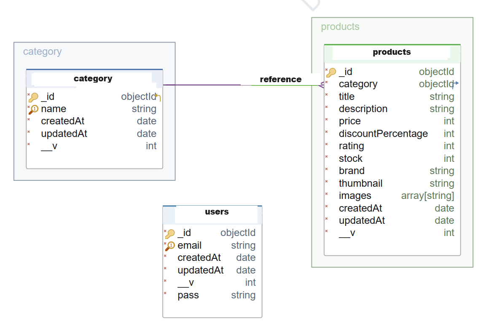

## Home Page

## Project Skeleton


```
Home Page/
  ├── index.js          // Express.js server setup
  ├── .env
  ├── src
      ┣ configs
      ┃ ┗ userController.js
      ┃ ┗ dbConnection.js
      ┣ controllers
      ┃ ┣ adminController.js
      ┃ ┣ productsController.js
      ┃ ┗ userController.js
      ┣ helpers
      ┃ ┗ paswordEncrypte.js
      ┣ middlewares
      ┃ ┣ auth.js
      ┃ ┣ errorHandler.js
      ┃ ┣ getCors.js
      ┃ ┣ postCors.js
      ┃ ┗ queryHandler.js
      ┣ models
      ┃ ┣ productsModel.js
      ┃ ┗ userModel.js
      ┣ routes
      ┃ ┣ adminRoutes.js
      ┃ ┣ productsRoutes.js
      ┃ ┗ userRoutes.js
      ┗ sync.js
  ├── package.json    // Node.js project configuration
  └── README.md       // Project documentation
```
## Tech/framework used
- **Express.js:** Fast and flexible Node.js web application framework.
- **MongoDB:** Flexible and scalable NoSQL database solution.
- **Mongoose:** Object Data Modeling (ODM) library for MongoDB.
- **Cookie-session:** Middleware for session management in Express applications.
- **Cors:** Middleware for Cross-Origin Resource Sharing (CORS) in Express.
- **Dotenv:** Node.js module used for loading environment variables.
- **Express-async-errors:** Helper module for asynchronous error handling in Express applications.
- **Mongoose-validator:** Powerful validation library for Mongoose.
- **CRUD Operations** Users can create, read, update, and delete books from the database.
- **Middleware** Middleware functions are implemented to handle requests, perform validations, and enhance security.


## Project ERD



## Getting Started

This is an example of how you may give instructions on setting up your project locally.
To get a local copy up and running follow these simple example steps.

### Prerequisites

This is an example of how to list things you need to use the software and how to install them.

- npm
  ```sh
  npm install npm@latest -g
  ```

### Installation

_Below is an example of how you can instruct your audience on installing and setting up your app. This template doesn't rely on any external dependencies or services._

1. Clone the repo
   ```sh
   git clone https://github.com/esmaaksoy/Home-backend
   ```
2. Install NPM packages
   ```sh
   npm install
   ```
3. Create .env file in home directory.
   ```sh
   HOST=localhost
   PORT=8000
   MONGODB=ENTER YOUR Database adres or local: mongodb://127.0.0.1:27017/home
   SECRET_KEY=ENTER YOUR random letters and number, for example: jsl78dd9ff6f6s9jkd89Kkfnfd


   ```
4. The project is ready, you can start using it now.
   ```sh
   You can run:
   nodemon
   ```
 

